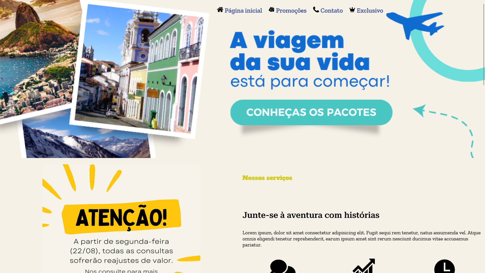
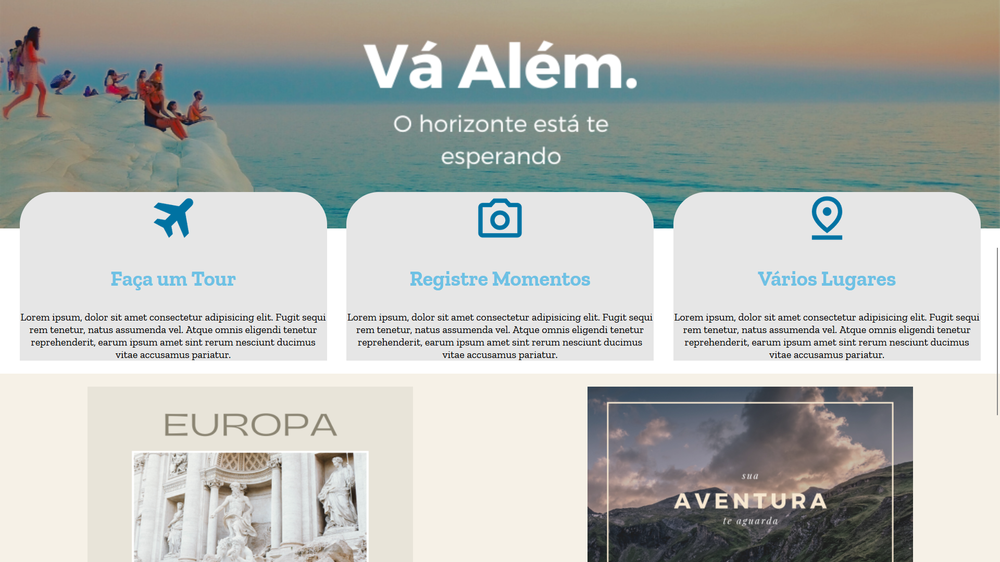

# Travel Agency - Travel Agency Landing Page


## Project Description

Travel Agency is a study project aimed at simulating a landing page for a travel agency. The primary goal is to practice creating an attractive and informative web page focused on persuading clients to purchase travel packages.

## Visual Showcase


_(Overview of the travel agency landing page.)_




## Technologies Used

* HTML5
* CSS3

## Services Used

- **GitHub:** Used for code versioning, collaboration, and hosting the project repository.
- **Node.js:** Used for the development server

## How to Run the Project

To view this project locally, follow these steps:

1.  **Clone the repository:**
    ```bash
    git clone https://github.com/Carlos-Juatan/Travel_Agency
    ```

2.  **Navigate to the project folder:**
    ```bash
    cd Travel_Agency
    ```

3.  **Install Node.js dependencies:**
    ```bash
    npm install
    ```

4.  **Run the development server:**
    ```bash
    npm run dev
    ```

5.  **Open the project in your browser:**
    The website will be available at `http://localhost:8080` (the port can be another if the port 8080 isn't available, check the output in your terminal).

## Main Features

* **Promotional Banner:** A visual highlight with a catchy message encouraging the purchase of travel packages.
* **Featured Travel Packages:** Section to present different travel packages with relevant information.
* **"Why Travel With Us?" Section:** Persuasive arguments to convince clients to choose the agency.
* **Contact/Inquiry Form:** A way for visitors to get in touch with the agency.
* **Image Gallery:** Visual presentation of travel destinations or experiences.
* **Testimonials/Reviews Section:** Positive feedback from previous clients to build trust.

## Versioning

1.0.0.0

## Author

This "Travel_Agency" project was developed by Carlos Juatan as an educational project.

You can find more of my projects and contributions on my GitHub profile: https://github.com/Carlos-Juatan/

Feel free to explore the code and reach out if you have any questions or suggestions!

## License

This project is licensed under the MIT License. See the [MIT-License](https://github.com/Carlos-Juatan/Travel_Agency/blob/main/LICENSE) file for more information regarding the terms and conditions under which this software is licensed.